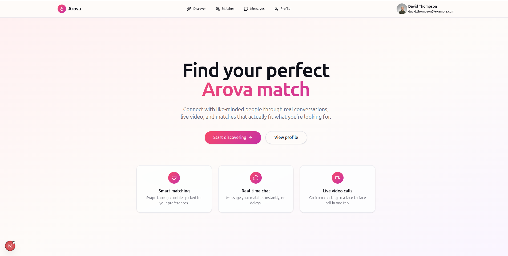

# Arova — Dating App

<div align="center">
  <br />
  
  <br />
  <div>
    
    
    
    
    
    
  </div>
  <h3 align="center">Match Making SaaS — Next.js 15, Supabase, Stripe, and Stream</h3>
</div>

---

## Overview

Arova is a full-stack dating app: swipe-based matching, real-time chat, and
live video calls, built on Next.js (App Router), Supabase, Stripe, and Stream.

## Tech stack

| Layer | Choice |
| --- | --- |
| Framework | Next.js 15 (App Router), React 19, TypeScript |
| Database / Auth / Storage | Supabase (Postgres, Row Level Security, Auth, Storage) |
| Realtime chat & video | Stream Chat + Stream Video React SDK |
| Server state | TanStack React Query |
| Client/UI state | Zustand (`store/auth-store.ts`, `store/call-store.ts`) |
| Forms & validation | React Hook Form + Zod |
| UI components | shadcn/ui (Radix primitives) + Tailwind CSS v4 |
| Icons | lucide-react |
| Toasts | Sonner |
| Git hooks | Husky + lint-staged + Prettier |

## Features

- Email/password auth with Supabase, route protection via middleware
- Swipeable discovery deck with like/pass, mutual-match detection
- Match list and conversation list, both backed by React Query
- Real-time 1:1 messaging (Stream Chat), with typing indicators
- One-tap video calling from a conversation (Stream Video), with an
  incoming-call prompt shared globally via the Zustand call store
- Editable profile (name, username, gender, birthday, bio, avatar) with
  Zod-validated forms and photo upload to Supabase Storage
- Loading, empty, and error states everywhere data is fetched
- Responsive layout with a mobile Sheet nav and desktop dropdown menu

## Quick start

```bash
pnpm install
cp .env.local.example .env.local   # then fill in the values — see docs/SETUP.md
pnpm dev
```

`pnpm install` also runs `pnpm prepare`, which installs the Husky git hook —
see [docs/GIT-HOOKS.md](./docs/GIT-HOOKS.md) if that doesn't happen automatically.

Open http://localhost:3000.

## Documentation

| Doc | What's in it |
| --- | --- |
| [docs/SETUP.md](./docs/SETUP.md) | Prerequisites, environment variables, running the dev server, seeding fake profiles |
| [docs/DATABASE.md](./docs/DATABASE.md) | Full Supabase schema (tables, triggers, RLS policies), the storage bucket setup, and a known RLS gap to fix before shipping |
| [docs/ARCHITECTURE.md](./docs/ARCHITECTURE.md) | Project structure — where routes, components, hooks, and server actions live |
| [docs/DEPLOYMENT.md](./docs/DEPLOYMENT.md) | Deploying to Vercel |
| [docs/GIT-HOOKS.md](./docs/GIT-HOOKS.md) | What Husky/lint-staged do here and how it re-installs on a fresh clone |
